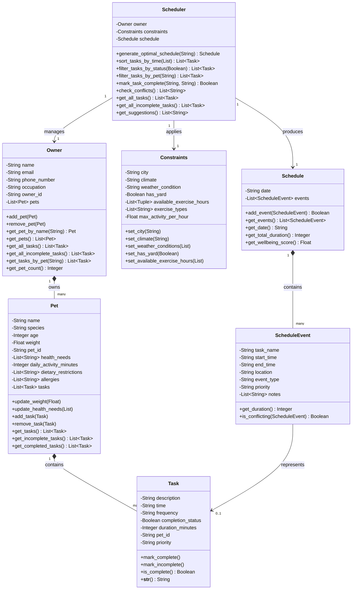

# PawPal+ System Architecture - Final UML Diagram

## Mermaid Class Diagram



## Architecture Overview

### Core Classes

#### **Task** ➜ Individual Activity
- Represents a single pet care activity (walk, feed, medication, etc.)
- Tracks completion status and frequency (daily/weekly)
- Methods for status tracking

#### **Pet** ➜ Individual Animal
- Represents a specific pet with health/dietary info
- Maintains list of tasks
- Provides task filtering by completion status

#### **Owner** ➜ Orchestrator
- Manages multiple pets
- Aggregates all tasks across pets
- Central data holder for the system

#### **Constraints** ➜ Rules & Limits
- Specifies scheduling boundaries
- Climate, weather, location, availability
- Exercise limits and preferences

#### **Schedule & ScheduleEvent** ➜ Output
- `Schedule`: Daily plan containing events
- `ScheduleEvent`: Individual scheduled activity with time window
- Prevents conflicting events

#### **Scheduler** ➜ Intelligence Engine
- **Phase 3 Logic**: Generates optimal schedule from tasks and constraints
- **Phase 5 Smart Algorithms**:
  - `sort_tasks_by_time()`: Chronological ordering (lambda + time conversion)
  - `filter_tasks_by_status()`: Complete vs incomplete separation
  - `filter_tasks_by_pet()`: Pet-specific task isolation
  - `mark_task_complete()`: Recurring task automation
  - `check_conflicts()`: Detailed conflict warnings
  - `get_suggestions()`: Optimization recommendations

## Data Flow

```
┌─────────────────────────────────────────────────────┐
│                    Streamlit UI (app.py)             │
│  • Owner info form                                   │
│  • Pet management                                    │
│  • Task creation                                     │
│  • Schedule generation button                        │
│  • Smart feature tabs                                │
└─────────────────────────────────────────────────────┘
                          ↓
┌─────────────────────────────────────────────────────┐
│             Data Model (pawpal_system.py)            │
│  • Task: description, time, priority, duration      │
│  • Pet: name, species, tasks[]                       │
│  • Owner: name, pets[]                               │
│  • Constraints: location, weather, availability     │
│  • Schedule: events[] for daily plan                 │
└─────────────────────────────────────────────────────┘
                          ↓
┌─────────────────────────────────────────────────────┐
│          Scheduler (Intelligence Engine)             │
│  ┌──────────────────────────────────────────┐       │
│  │ Phase 3: Schedule Generation              │       │
│  │ • Optimal scheduling algorithm            │       │
│  │ • Conflict prevention                     │       │
│  │ • Wellbeing scoring                       │       │
│  └──────────────────────────────────────────┘       │
│  ┌──────────────────────────────────────────┐       │
│  │ Phase 5: Smart Algorithms                 │       │
│  │ • sort_tasks_by_time()  ──→ Sorted[]     │       │
│  │ • filter_tasks_by_status() ──→ Complete[]│       │
│  │ • filter_tasks_by_pet() ──→ PetTasks[]   │       │
│  │ • mark_task_complete() ──→ Auto-create   │       │
│  │ • check_conflicts() ──→ Warnings[]        │       │
│  └──────────────────────────────────────────┘       │
└─────────────────────────────────────────────────────┘
                          ↓
┌─────────────────────────────────────────────────────┐
│           Schedule Output (Display in UI)            │
│  • Time-ordered events                              │
│  • Priority indicators                              │
│  • Conflict warnings                                │
│  • Wellbeing score                                  │
│  • Smart feature filters & sorts                    │
└─────────────────────────────────────────────────────┘
```

## Key Design Decisions

### 1. **Separation of Concerns**
- **Data**: Task, Pet, Owner classes (simple data holders)
- **Logic**: Scheduler class (all algorithm logic)
- **UI**: app.py (Streamlit components)

### 2. **Smart Algorithm Architecture**
All algorithms in Scheduler class use:
- **Sorting**: Lambda function for time conversion
- **Filtering**: List comprehension for efficient selection
- **Conflict Detection**: Duration overlap checking (not exact time matching)
- **Automation**: Datetime manipulation for recurring tasks

### 3. **Conflict Prevention**
- Schedule.add_event() checks for conflicts before adding
- Scheduler.check_conflicts() reports detailed warnings
- Overlapping events prevented at insertion time

### 4. **Extensibility**
- Easy to add new filters (add method to Scheduler)
- Easy to add new constraints (add field to Constraints)
- Event properties extensible (notes, location, etc.)

## Method Summary by Phase

### **Phase 1-2: Foundation** (Classes & Basic Methods)
- Task: create, mark_complete, is_complete
- Pet: add_task, remove_task, get_tasks
- Owner: add_pet, remove_pet, get_pet_by_name
- Schedule: add_event, get_events, prevent conflicts
- Constraints: set configuration

### **Phase 3: Scheduling Logic** (Algorithm)
- Scheduler: generate_optimal_schedule()
  - Creates schedule with events
  - Orders tasks by priority
  - Prevents time conflicts
  - Calculates wellbeing score

### **Phase 4: UI Integration** (Streamlit)
- app.py: All UI components wired to classes
- Session state persistence
- Form inputs → class instantiation
- Button clicks → method calls

### **Phase 5: Smart Algorithms** (Intelligence)
- Scheduler: sort_tasks_by_time()
- Scheduler: filter_tasks_by_status()
- Scheduler: filter_tasks_by_pet()
- Scheduler: mark_task_complete() (auto-recurring)
- Scheduler: check_conflicts() (warnings)
- Scheduler: get_suggestions() (optimization)

### **Phase 6: Testing** (Validation)
- 30 comprehensive unit tests
- 100% pass rate
- Edge cases covered
- Smart algorithms verified

### **Phase 7: Packaging** (Documentation)
- Enhanced UI with smart features
- Final UML diagram
- Comprehensive README
- AI collaboration reflection

## Final Statistics

- **Lines of Code**: 1,067 (pawpal_system.py)
- **Methods**: 50+ across all classes
- **Smart Algorithms**: 5 core + variations
- **Test Coverage**: 30 tests, 100% pass rate
- **UI Features**: 8 tabs + smart feature toggles
- **Documentation Files**: 10+

## Class Dependencies

```
┌─────────────┐
│   Task      │ (independent)
└──────┬──────┘
       │ "many"
       │
┌──────▼──────┐
│    Pet      │
└──────┬──────┘
       │ "many"
       │
┌──────▼──────────────┐
│     Owner           │
└──────┬──────────────┘
       │
       ├──► ┌─────────────┐
       │    │ Constraints │
       │    └─────────────┘
       │
       └──► ┌──────────────┐
            │ Scheduler    │
            └───────┬──────┘
                    │
                    └──► ┌─────────────────────┐
                         │ Schedule            │
                         │ ├─ ScheduleEvent    │
                         └─────────────────────┘
```

---

**System Design Complete** ✅  
Final revision: March 29, 2026  
All classes implemented and tested
